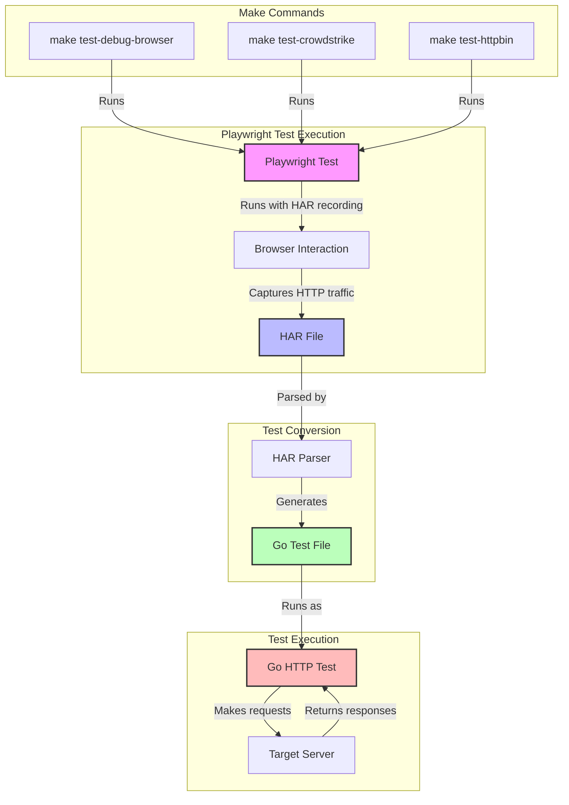

# Playwright to Go Test Converter

This tool converts Playwright-Go tests into Go HTTP tests by capturing HTTP traffic in HAR format and generating equivalent Go test files. It's particularly useful for:

- Converting browser-based tests to pure HTTP tests
- Creating API test suites from browser interactions
- Maintaining both browser and API test coverage
- Generating Go tests from recorded browser sessions

## Workflow



## Prerequisites

- Go 1.21 or later
- Playwright-Go
- Chrome/Chromium browser

## Installation

1. Clone the repository:
```bash
git clone https://github.com/yourusername/playwright2gotest.git
cd playwright2gotest
```

2. Install dependencies:
```bash
go mod tidy
```

3. Install Playwright browsers:
```bash
go run github.com/playwright-community/playwright-go/cmd/playwright install
```

## Project Structure

```
playwright2gotest/
├── cmd/
│   └── converter/        # Command-line converter tool
├── examples/            # Example Playwright tests
├── har/                # Generated HAR files
├── internal/
│   └── gotest/         # Go test generation logic
└── tests/              # Generated Go tests
```

## Usage

### Using Makefile

The project includes a Makefile with several useful commands for running tests:

```bash
# Run all tests
make test-all

# Run specific test suites
make test-crowdstrike    # Run only CrowdStrike tests
make test-httpbin       # Run only HttpBin tests

# Run tests with Playwright debug mode
make test-debug                 # All tests with debug mode
make test-debug-crowdstrike     # CrowdStrike tests with debug mode
make test-debug-httpbin        # HttpBin tests with debug mode

# Run tests with Playwright debug mode and show browser
make test-debug-browser              # All tests with debug mode and browser
make test-debug-browser-crowdstrike  # CrowdStrike tests with debug mode and browser
make test-debug-browser-httpbin     # HttpBin tests with debug mode and browser

# Other commands
make install  # Install dependencies and Playwright browsers
make clean    # Remove generated files
make help     # Show all available commands
```

The debug mode is particularly useful when:
- Debugging test failures
- Finding correct selectors for elements
- Understanding the test flow
- Capturing HAR files

### Test Organization

Tests are organized into different suites:
- `examples/crowdstrike_test.go` - Tests for CrowdStrike website interactions
- `examples/httpbin_test.go` - Tests for HttpBin API interactions

Each test suite can be run independently using the specific make commands above.

### 1. Create a Playwright Test

Create a Playwright test that captures HAR output:

```go
package examples

import (
    "github.com/playwright-community/playwright-go"
)

func TestExample(t *testing.T) {
    // Create a new browser context with HAR recording
    context, err := browser.NewContext(playwright.BrowserNewContextOptions{
        RecordHarPath:        playwright.String("har/example.har"),
        RecordHarOmitContent: playwright.Bool(false),
        RecordHarMode:        playwright.HarModeMinimal,
    })
    
    // Your test code here...
    
    // Close context to save HAR file
    context.Close()
}
```

### 2. Run the Playwright Test

```bash
cd examples
go test -v
```

### 3. Convert HAR to Go Test

```bash
go run cmd/converter/main.go -input har -output tests
```

### 4. Run the Generated Go Test

```bash
cd tests
go test -v
```

## Example

Here's a complete example of the workflow:

1. Write a Playwright test that makes HTTP requests:
```go
// examples/httpbin_test.go
func TestHttpBinRequests(t *testing.T) {
    // Setup HAR recording...
    
    // Make GET request
    page.Goto("https://httpbin.org/get")
    
    // Make POST request
    page.Evaluate(`
        fetch('https://httpbin.org/post', {
            method: 'POST',
            headers: {
                'Content-Type': 'application/json'
            },
            body: JSON.stringify({message: 'Hello, World!'})
        })
    `)
}
```

2. Run the test to generate HAR:
```bash
cd examples
go test -v
```

3. Convert HAR to Go test:
```bash
go run cmd/converter/main.go -input har -output tests
```

4. The generated Go test will look like:
```go
// tests/httpbin_test.go
func TestHttpbin(t *testing.T) {
    client := &http.Client{}
    
    // Test GET request
    req1, err := http.NewRequest("GET", "https://httpbin.org/get", nil)
    // ... assertions ...
    
    // Test POST request
    req2, err := http.NewRequest("POST", "https://httpbin.org/post", 
        bytes.NewBufferString(`{"message":"Hello, World!"}`))
    // ... assertions ...
}
```

## Complex Example: CrowdStrike Website Interaction

This example demonstrates how to capture HTTP traffic from a more complex website interaction, including search functionality:

1. Create a Playwright test that interacts with crowdstrike.com:
```go
// examples/crowdstrike_test.go
func TestCrowdStrikeInteractions(t *testing.T) {
    // Setup browser with HAR recording
    context, err := browser.NewContext(playwright.BrowserNewContextOptions{
        RecordHarPath: playwright.String("har/crowdstrike.har"),
        RecordHarMode: playwright.HarModeMinimal,
    })
    
    // Navigate to homepage
    page.Goto("https://www.crowdstrike.com")
    
    // Handle cookie consent
    page.Click("text=Accept All Cookies")
    
    // Perform search
    page.Click("button[aria-label='Search']")
    page.Fill("input[type='search']", "Falcon")
    page.Press("input[type='search']", "Enter")
    
    // Click search result
    page.Click("a.search-result-item")
}
```

2. Run the test to capture the interaction:
```bash
cd examples
go test -v
```

3. Convert the captured HAR to a Go test:
```bash
go run cmd/converter/main.go -input har/crowdstrike.har -output tests/crowdstrike_test.go
```

4. The generated Go test will include all HTTP requests made during the interaction:
```go
// tests/crowdstrike_test.go
func TestCrowdStrike(t *testing.T) {
    client := &http.Client{}
    
    // Test homepage request
    req1, err := http.NewRequest("GET", "https://www.crowdstrike.com", nil)
    // ... assertions ...
    
    // Test search API request
    req2, err := http.NewRequest("GET", "https://www.crowdstrike.com/api/search", nil)
    req2.URL.RawQuery = "q=Falcon"
    // ... assertions ...
    
    // Test search result page request
    req3, err := http.NewRequest("GET", "https://www.crowdstrike.com/falcon-platform", nil)
    // ... assertions ...
}
```

This example shows how the converter can handle:
- Complex website interactions
- Search functionality
- Dynamic content loading
- Cookie handling
- Multiple page navigation
- API requests

## Features

- Captures HTTP traffic from Playwright tests
- Generates idiomatic Go tests
- Handles GET and POST requests
- Preserves headers and request bodies
- Validates response status codes and bodies
- Supports JSON request/response handling

## Contributing

Contributions are welcome! Please feel free to submit a Pull Request.

## License

This project is licensed under the MIT License - see the LICENSE file for details.