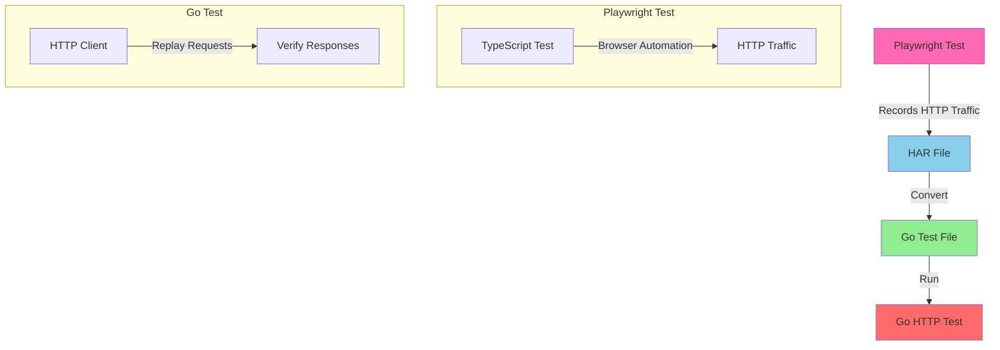

# Playwright to Go Test Converter

A tool that converts Playwright browser tests into Go HTTP tests by capturing and replaying HTTP traffic.

## Overview

This project provides a way to convert browser-based Playwright tests into pure HTTP tests in Go. It works by:

1. Recording HTTP traffic during Playwright test execution
2. Converting the recorded traffic (HAR files) into Go test files
3. Running the generated Go tests to verify HTTP endpoints

## Prerequisites

- Go 1.21 or later
- Node.js 18 or later
- Playwright/Test (TypeScript)

## Installation

1. Clone the repository:
```bash
git clone https://github.com/yourusername/playwright2gotest.git
cd playwright2gotest
```

2. Install Go dependencies:
```bash
make install
```

3. Install TypeScript dependencies:
```bash
make install-ts
```

## Project Structure

```
playwright2gotest/
├── cmd/
│   └── converter/        # HAR to Go test converter
├── internal/
│   └── gotest/          # Go test generation logic
├── playwright-tests/     # TypeScript Playwright tests
├── tests/               # Generated Go tests
├── examples/            # Example HAR files
└── Makefile            # Build and test commands
```

## Usage

### Running TypeScript Tests

1. Run a specific test suite:
```bash
make test-ts-crowdstrike  # Run CrowdStrike test
make test-ts-httpbin     # Run HttpBin test
```

2. Run tests in debug mode:
```bash
make test-ts-debug       # Run all tests with browser UI
```

### Converting to Go Tests

1. Convert HAR files to Go tests:
```bash
go run cmd/converter/main.go -input examples/crowdstrike.har -output tests/crowdstrike_test.go
```

2. Run the generated Go tests:
```bash
cd tests && go test -v -run TestCrowdstrike
```

### Make Commands

- `make install` - Install Go dependencies
- `make install-ts` - Install TypeScript dependencies
- `make test-ts` - Run all TypeScript tests
- `make test-ts-debug` - Run TypeScript tests in debug mode
- `make test-ts-crowdstrike` - Run CrowdStrike TypeScript test
- `make test-ts-httpbin` - Run HttpBin TypeScript test
- `make clean` - Clean up generated files

## Workflow



## Features

- Convert Playwright browser tests to Go HTTP tests
- Support for both TypeScript and Go test workflows
- Automatic HAR file recording during Playwright test execution
- Configurable HTTP request/response validation
- Minimal dependencies (pure HTTP testing)

## Limitations

- Some browser-specific features may not be captured in HAR files
- Dynamic content and JavaScript execution are not supported in Go tests
- Authentication and session management may require manual configuration
- Status code validation is lenient (accepts 2xx and 3xx responses)

## Contributing

1. Fork the repository
2. Create your feature branch
3. Commit your changes
4. Push to the branch
5. Create a Pull Request

## License

This project is licensed under the MIT License - see the LICENSE file for details.